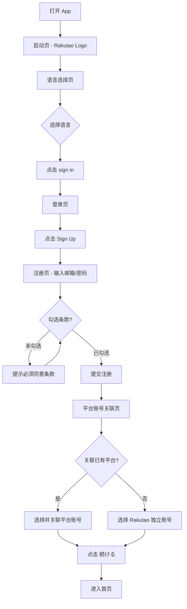
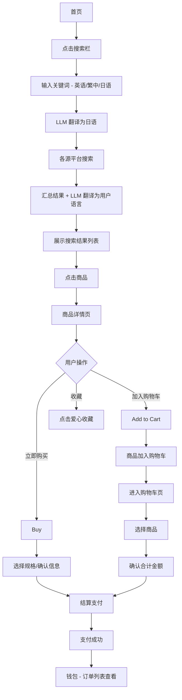
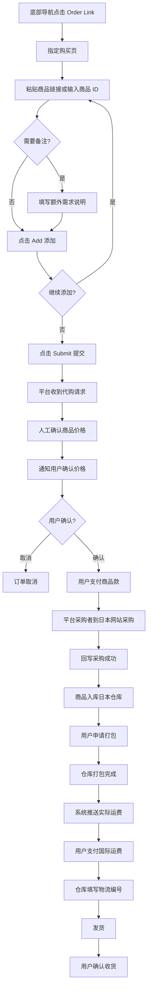
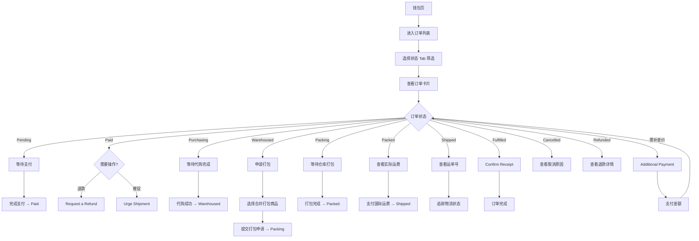
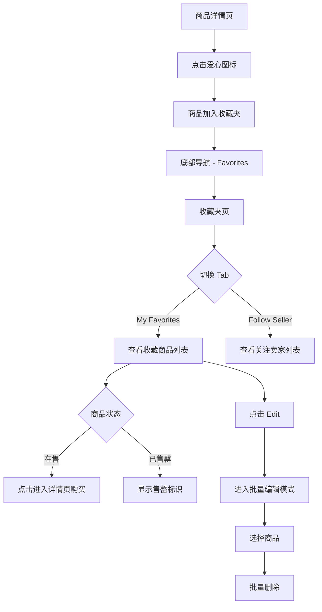
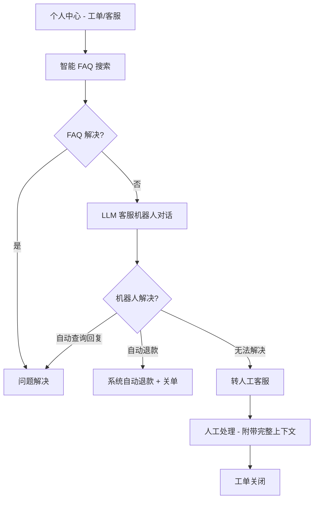
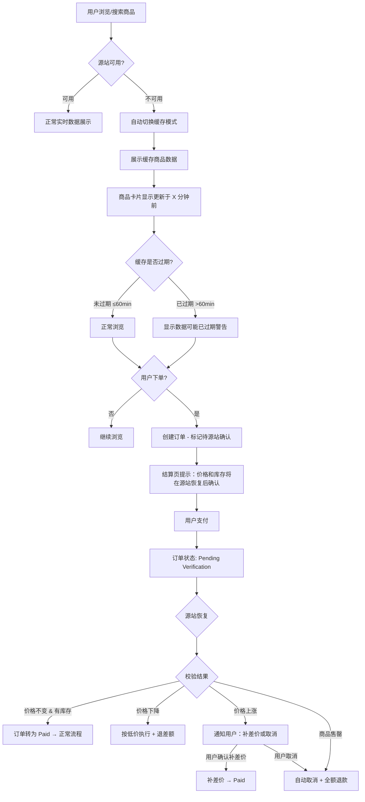

# Rakutao International - Product Requirements Document (PRD)

> **Product Version**: 2.0（产品版本）
> **Document Revision**: Rev.4（文档修订版）
> **Date**: 2026-02-25
> **Status**: Draft
> **Author**: PM Agent
> **Related**: [Project Brief](./project-brief.md) | [v2 Upgrade Design](./plans/2026-02-11-prd-v2-upgrade-design.md) | [Architecture](./architecture.md)
>
> **Changelog**:
> - Rev.4 (2026-02-25): 明确国际版第一期平台范围（雅虎日拍、亚马逊、骏河屋、Animate、罗针盘）；调整第一期支付方式为钱包+微信+支付宝；默认语言改为日语；开放成人类分类和关键词黑名单、保持涉政类屏蔽；统一定价策略（日元含税价、10%手续费、费用由客户承担）；明确海外应用商店上架策略、收件地址排除中国大陆；新增商品策略/仓储策略/物流策略/注册策略等大方向标准
> - Rev.3 (2026-02-24): 补充战略决策、商业模型、数据隐私合规、风险约束、成功指标、术语表；新增源站容灾与商品缓存需求（FR-SRC）；完善全部 P0 功能 Acceptance Criteria；修复订单 10 态定义不一致、优先级标注不统一、FR-HOME-004 与隐藏平台策略矛盾等问题
> - Rev.2 / v2.0 (2026-02-11): 新增代购直播、WMS 仓储、直接支付、内容分级、个性化推荐、地区化运营、智能客服、高价值商品优化
> - Rev.1 / v1.0: MVP 初版

---

## 1. Product Overview

Rakutao International 是一款面向全球用户（中国大陆除外）的日本商品聚合代购移动应用。平台聚合多个日本电商平台的商品数据，以 Rakutao 自有品牌统一呈现，隐藏底层来源平台。**第一期平台范围**：雅虎日拍（Yahoo Auctions Japan）、亚马逊日本（Amazon Japan）、骏河屋（Suruga-ya）、Animate、罗针盘（Lashinbang）。后续逐步扩展 Mercari、Rakuma、TOBU、SuperDelivery 等更多平台。用户可通过搜索浏览、粘贴商品链接（指定购买）或代购直播三种方式下单，由 Rakutao 在日本代为购买，商品入库日本仓库后由用户申请打包并支付国际运费发货。所有商品仅限日本海关允许针对个人出口的商品。首批重点市场为东南亚（越南等）和台湾，通过地区配置化架构快速扩展至全球更多市场。

**v2.0 新增能力**：
- **代购直播**：代购者在日本实体店/展会现场直播，用户实时下单
- **WMS 仓储系统**：独立仓储管理微服务，支持入库→打包→发货全流程
- **支付方式分期**：第一期支持钱包支付、微信支付、支付宝支付；后续扩展 Apple Pay / Google Pay / PayPal 直接支付
- **内容分级**：开放大部分被屏蔽分类（含成人类），仅保持涉政类屏蔽；年龄验证与地区合规控制
- **个性化推荐**：基于用户偏好和行为的智能推荐与推送
- **地区化运营**：不同地区差异化推广内容和风格，统一交互体验
- **指定购买升级**：曾指定购买过的平台自动解锁实时代理搜索
- **智能客服**：LLM 客服机器人 + 工单自动化，降低人工成本
- **高价值商品优化**：鉴定、保价物流、保险、专属客服、防欺诈全流程

App 默认繁体中文，支持日语和英语，所有商品信息通过 LLM 实时翻译为用户所选语言。以日本法人实体上架海外地区的 App Store 和 Google Play，国内应用商店均不上架，中国大陆地区不可用。所有商品价格和服务价格以日元含税价展示，代购手续费统一为 10%，所有消费税、支付手续费等费用由客户承担。所有地区站点共享统一 UI 框架和交互模式，仅在内容和视觉风格上做地区差异化，减少用户跨站学习成本。

### 1.1 Strategic Design Decisions & v2 Evolution

> 核心设计决策详细推演参见 [Project Brief §1.5](./project-brief.md)，以下为摘要及 v2 演进说明。

| 决策 | 核心逻辑 | v2 演进 |
|------|---------|---------|
| **隐藏来源平台** | 将"聚合 + 翻译 + 代购 + 物流"打包为不可拆分的服务。暴露来源平台会让用户绕过中间商 | 不变。直播场景中代购者在日本现场展示商品，进一步强化 Rakutao 品牌而非源平台 |
| **搜索 + 指定购买双通道** | 搜索覆盖"模糊意图"，指定购买覆盖"明确目标"。指定购买将社交网络变成 Rakutao 的流量入口 | v2 新增：曾指定购买过的平台自动解锁实时代理搜索，两个通道开始融合 |
| **支付方式分期扩展** | v1 钱包预充值：解耦支付碎片化与消费场景，适配代购天然时间差（多次环节扣款合并为一次充值），资金沉淀创造粘性 | **第一期支持钱包支付、微信支付、支付宝支付**（复用现有支付通道，快速上线）。后续扩展 Apple Pay / Google Pay / PayPal 直接支付，降低海外用户首单门槛。**所有消费税、支付手续费等费用由客户承担** |
| **JPY 含税价统一标价** | 将汇率风险转化为用户已知变量。平台避免汇率对赌，用户获得价格确定性 | v2 明确：所有商品价格和附加服务价格统一以日元含税价展示，代购手续费统一为 10% |
| **日本法人 + 默认日语** | 法律合规（降低跨境电商审核复杂度）+ 信任构建（"日本公司卖日本商品"）。默认日语贴合日本法人定位与商品来源地 | v2 变更：默认语言调整为日语，贴合日本法人定位 |
| **屏蔽中国大陆** | 战略聚焦——避免与淘宝/京东正面竞争，集中资源在东南亚蓝海市场 | v2 强化：国内应用商店均不上架，仅上架海外 App Store 和 Google Play；禁止中国大陆手机号注册；禁止中国大陆收件地址。测试需使用海外地区苹果/Google 账号 |
| **LLM 翻译而非人工** | C2C 平台每日数十万新品、生命周期仅数小时，人工翻译不可经济可行 | 不变。v2 智能客服也复用 LLM 能力 |
| **工单而非在线客服** | 代购订单生命周期是"天"级别，在线客服会创造无法兑现的"即时回复"预期 | v2 新增 LLM 客服机器人前置分流，工单作为兜底。沟通节奏与业务节奏对齐 |

### 1.2 Business Model

| 收入来源 | 说明 | v2 变化 |
|---------|------|---------|
| **代购手续费** | 每笔订单收取 10% 代购手续费（含在展示价格中），所有消费税、支付手续费等费用由客户承担 | v2 明确统一费率为 10% |
| **汇率差价** | JPY ↔ 用户本币兑换差价 | 不变 |
| **运费差价** | 日本国内 + 国际运费整合定价的规模化差价 | WMS 自营仓储提升运费利润率 |
| **钱包资金沉淀** | 预充值余额的资金时间价值 | 直接支付分流部分，但钱包仍保留 |
| **直播佣金** | 代购直播中产生的订单抽成 | v2 新增 |
| **鉴定服务费** | 高价值商品第三方鉴定服务费用 | v2 新增 |
| **保险佣金** | 保价物流保险的渠道佣金 | v2 新增 |

---

## 2. User Personas

### Persona 1: Linh（越南，25 岁，白领女性）— 东南亚市场代表

| 维度 | 描述 |
|------|------|
| **背景** | 胡志明市办公室职员，月收入约 1500 万越南盾，热衷日本潮流文化和二手奢侈品 |
| **痛点** | 不懂日语，无法直接在 Mercari 上购物；曾通过 Facebook 代购被骗；价格不透明 |
| **使用动机** | 想要安全、便捷地购买日本二手奢侈品和潮流单品，需要翻译支持和价格透明 |
| **关键场景** | 午休浏览推荐商品 → 搜索特定品牌 → 查看翻译后的商品详情 → 加入购物车 → 付款 → 在钱包页追踪物流 |

### Persona 2: Wei-Ting（台湾，32 岁，工程师）— 东亚市场代表

| 维度 | 描述 |
|------|------|
| **背景** | 台北工程师，收集日本限定游戏主机和周边，能看懂部分日语 |
| **痛点** | 日本电商不支持国际配送，转运服务流程繁琐，拍卖竞价操作不便 |
| **使用动机** | 希望直接贴入商品链接完成购买，有人代为处理物流，繁体中文界面 |
| **关键场景** | 在社交媒体发现商品 → 复制链接到指定购买 → 等待平台确认价格 → 付款 → 钱包页查看运单详情 |

### Persona 3: Tran（越南，40 岁，小型代购商）— B2B/代购商代表

| 维度 | 描述 |
|------|------|
| **背景** | 经营日本代购小生意，通过 Facebook 群组为客户采购日本商品 |
| **痛点** | 多平台查找效率低，汇率运费计算复杂，大量订单管理困难 |
| **使用动机** | 需要一个聚合平台提高商品查找效率，统一管理订单和资金流水 |
| **关键场景** | 批量搜索商品 → 收藏关注卖家 → 下单 → 钱包统一管理订单和流水 → 工单处理售后问题 |

### Persona 4: Emma（美国，28 岁，日本文化爱好者）— 欧美市场代表

| 维度 | 描述 |
|------|------|
| **背景** | 纽约设计师，日本动漫和潮牌深度爱好者，经常购买日本限定商品和二手奢侈品 |
| **痛点** | 日本电商不支持美国配送，现有代购服务价格不透明、流程不可追踪，语言障碍 |
| **使用动机** | 需要可信赖的代购平台，支持 Apple Pay/PayPal 支付，英语界面，物流全程可追踪 |
| **关键场景** | 观看代购直播 → 实时下单限定商品 → PayPal 支付 → 追踪国际物流 → 确认收货 |

### Persona 5: Ahmed（沙特，35 岁，收藏家）— 中东市场代表

| 维度 | 描述 |
|------|------|
| **背景** | 利雅得企业主，收藏日本高端手表、限定球鞋和艺术品，注重商品真伪和物流安全 |
| **痛点** | 高价值商品代购风险大，担心假货和物流损坏，需要鉴定和保价服务 |
| **使用动机** | 需要提供鉴定、保价物流、保险的高端代购服务，愿意为高品质服务付费 |
| **关键场景** | 搜索限定商品 → 勾选贵重物品标记 → Apple Pay 支付 → 查看鉴定结果 → 保价物流发货 → 专属客服跟进 |

---

## 3. Functional Requirements (FR)

### 3.1 启动与引导流程 (Onboarding)

| ID | 需求 | 优先级 | 描述 |
|----|------|--------|------|
| FR-ONB-001 | 启动页展示 | P0 | 打开 App 显示 Rakutao 品牌启动页（红色 Logo），加载完成后自动跳转 |
| FR-ONB-002 | 语言选择页 | P0 | 首次启动展示语言选择页，提供三个选项：日本語（默认高亮）、繁體中文、English，选择后点击 "sign in" 进入登录页 |
| FR-ONB-003 | 语言持久化 | P0 | 用户选择的语言保存到本地，后续启动自动应用，无需重复选择 |

### 3.2 用户认证 (Authentication)

| ID | 需求 | 优先级 | 描述 |
|----|------|--------|------|
| FR-AUTH-001 | 邮箱密码登录 | P0 | 用户输入邮箱和密码进行登录，邮箱格式校验通过显示绿色勾号；密码输入框支持显示/隐藏切换 |
| FR-AUTH-002 | 邮箱注册 | P0 | 点击 "Sign Up" 进入注册流程，填写邮箱、密码完成注册。禁止使用中国大陆手机号注册（如后续支持手机号注册） |
| FR-AUTH-003 | 社交账号登录 | P1 | 支持 Apple、Google、X（Twitter）、Facebook 四种第三方登录方式，登录页底部展示四个图标 |
| FR-AUTH-004 | 条款同意 | P0 | 登录/注册页底部展示 "I agree to Rakutao's Terms of Use and Privacy Policy" 勾选框，必须勾选后才能提交 |
| FR-AUTH-005 | 忘记密码 | P1 | 登录页提供 "Forgot Password?" 链接（蓝色），点击进入密码重置流程（邮箱验证码） |
| FR-AUTH-006 | 平台账号关联 | P1 | 登录成功后进入平台选择页，展示可关联的第三方平台（第一期：雅虎日拍、亚马逊日本、骏河屋、Animate、罗针盘等），用户可选择 Rakutao 独立账号或关联已有平台账号，点击"続ける"继续 |
| FR-AUTH-007 | 登出 | P0 | 个人中心提供 "Sign Out" 按钮，点击后清除登录态并跳转到登录页 |
| FR-AUTH-008 | 注册取消确认 | P1 | 注册过程中返回时弹出确认弹窗 "Cancel registration?"，提供 "Continue" 和 "Cancel" 两个选项 |

### 3.3 首页 (Home)

| ID | 需求 | 优先级 | 描述 |
|----|------|--------|------|
| FR-HOME-001 | 商品列表展示 | P0 | 首页以瀑布流/网格形式展示商品，每个商品卡片包含：缩略图（114x114px, radius:10）、价格（JPY）、商品标签（Free Shipping / New 等）。隐藏来源平台信息，强化 Rakutao 品牌 |
| FR-HOME-002 | 搜索功能 | P0 | 顶部搜索栏，支持多语言输入（英语/繁中/日语），非日语输入通过 LLM 翻译为日语后在各源平台搜索，搜索结果翻译回用户语言展示 |
| FR-HOME-003 | 分类标签导航 | P0 | 首页提供分类标签横向滚动导航：Picks（默认选中，红色高亮）、Home、Brands、Official、18kin 等 |
| FR-HOME-004 | 商品来源分区浏览 | P1 | 支持按 Rakutao 自定义商品分区浏览（如"精选二手"、"批发直供"、"品牌官方"等），分区基于后台源平台映射但前端不暴露源平台名称，保持品牌统一性 |
| FR-HOME-005 | 子分类筛选 | P1 | 平台商品页内提供子分类标签：入荷、商品、講品、美容、漫画、動漫 等 |
| FR-HOME-006 | 通知入口 | P0 | 顶部导航栏右侧显示通知图标（铃铛），有未读通知时显示红点标识；点击进入通知中心 |
| FR-HOME-007 | 个性化推荐 | P1 | 首页"猜你喜欢"区域展示个性化推荐商品，详细逻辑见 FR-REC-001 |
| FR-HOME-008 | 下拉刷新 | P0 | 首页支持下拉刷新，重新加载商品数据 |
| FR-HOME-009 | 无限滚动加载 | P0 | 商品列表支持向下无限滚动，分页加载更多商品 |
| FR-HOME-010 | 拍卖专区入口 | P1 | 首页提供拍卖专区入口，点击进入拍卖商品列表页 |

### 3.4 商品详情页 (Product Detail)

| ID | 需求 | 优先级 | 描述 |
|----|------|--------|------|
| FR-PD-001 | 商品大图展示 | P0 | 顶部展示商品大图，支持左右滑动轮播多张图片 |
| FR-PD-002 | 商品标题与翻译 | P0 | 显示商品标题（LLM 翻译为用户语言），翻译内容旁显示 "Translation" 胶囊标签（H:25PX, radius:20） |
| FR-PD-003 | 价格展示 | P0 | 显示商品价格（JPY 含税价，粗体红色）和汇率换算参考价（灰色小字，如 "Exchange rate: 0.93..."）。所有价格均为日元含税价，代购手续费（10%）含在展示价格中 |
| FR-PD-004 | 商品标签 | P0 | 展示商品标签：Free Shipping（描边样式）、Freight Collect（填充/描边样式，显示金额如 JPY 800）、New 等 |
| FR-PD-005 | 更新时间 | P1 | 显示商品信息最后更新时间（如 "updated 15 mins ago"） |
| FR-PD-006 | 规格选择 | P0 | 提供 "Variant Selection" 区域，点击 "Select >" 展开规格选择面板（颜色、尺码等） |
| FR-PD-007 | 运费信息 | P0 | 展示运费详情：日本国内运费（Within Japan，日元含税价）、服务费（Service Charge，统一 10%）、国际运费（Global Delivery: Fee calculated after weighing，日元含税价）。所有附加服务收费同样按日元含税价显示 |
| FR-PD-008 | 卖家信息 | P1 | 展示卖家名称、商品数量（Product Count）、评价图标（点赞/评论数），隐藏源平台品牌 |
| FR-PD-009 | 商品属性列表 | P0 | 展示商品属性表：Category（分类层级）、Status、Details、Ship From（发货地）、Shipping Time（预估天数，标注 for reference only）、Shipping Method、Product Dimensions（尺寸和重量） |
| FR-PD-010 | 商品描述 | P0 | 展示商品详细描述（LLM 翻译），标注翻译标签 |
| FR-PD-011 | 推荐商品 | P1 | 详情页底部展示 "Recommended Products" 横向滚动列表 |
| FR-PD-012 | 加入购物车 | P0 | 底部操作栏提供 "Add to Cart" 按钮（白底描边），点击将商品加入购物车 |
| FR-PD-013 | 立即购买 | P0 | 底部操作栏提供 "Buy" 按钮（红色填充），点击进入结算流程 |
| FR-PD-014 | 收藏商品 | P0 | 提供收藏图标（爱心），点击切换收藏/取消收藏状态 |

### 3.5 购物车 (Cart)

| ID | 需求 | 优先级 | 描述 |
|----|------|--------|------|
| FR-CART-001 | 购物车商品列表 | P0 | 按卖家分组展示商品，每组显示：Seller ID、卖家名称、平台标签（隐藏来源平台名称）；每条商品显示缩略图、名称、价格（JPY 含税价红色粗体） |
| FR-CART-002 | 商品选择 | P0 | 每条商品左侧提供圆形选择框，支持单选/全选；卖家分组标题处提供分组全选 |
| FR-CART-003 | 价格变动提示 | P0 | 当商品价格与加入购物车时不同时，显示价格变动提示（如箭头标识涨跌） |
| FR-CART-004 | 售罄商品处理 | P1 | 已下架/售罄商品叠加 "Sold" 标签（红色对角线），提供 "Archive Sold Items" 按钮（Medium 按钮样式）和 "Delete" 按钮 |
| FR-CART-005 | 合计价格显示 | P0 | 底部固定栏显示已选商品合计价格：Total: JPY XXX,XXX |
| FR-CART-006 | 物流方式选择 | P1 | 提供物流方式选择（如 AirMail 勾选框），不同物流方式影响运费 |
| FR-CART-007 | 安全状态提示 | P1 | 底部显示 "Safe Status" 安全交易提示标签 |
| FR-CART-008 | 结算购买 | P0 | 底部提供 "Buy" 按钮（红色），点击对已选商品发起结算支付 |
| FR-CART-009 | 商品删除 | P0 | 支持从购物车中删除单个商品（左滑删除或编辑模式删除） |
| FR-CART-010 | 空购物车状态 | P1 | 购物车为空时展示空状态提示和引导 |

### 3.6 指定购买 (Order Link)

| ID | 需求 | 优先级 | 描述 |
|----|------|--------|------|
| FR-OL-001 | 链接输入 | P0 | 提供输入框 "Please enter the product's link or ID."，用户可粘贴商品 URL 或商品 ID |
| FR-OL-002 | 备注说明 | P1 | 提供文本域 "Please let us know your additional requests."，用户可填写特殊需求（如指定颜色、附加服务等） |
| FR-OL-003 | 添加与提交 | P0 | 提供两个按钮："Add"（白底描边）添加到待提交列表，"Submit"（蓝色填充）提交代购请求 |
| FR-OL-004 | 流程引导图 | P0 | 页面展示代购流程图标：Enter Product Link → Agent Confirms Price → Make Payment（Pending → Paid）→ We Buy For You（Purchasing）→ 入库（Warehoused）→ 申请打包（Packing）→ 打包完成确认运费（Packed）→ 支付运费 → 发货（Shipped）→ 确认收货（Fulfilled），帮助用户理解全流程 |
| FR-OL-005 | 支持平台展示 | P1 | 页面底部展示支持的平台 Logo 列表。第一期：雅虎日拍、亚马逊日本、骏河屋、Animate、罗针盘；后续扩展更多平台，让用户了解可代购的平台范围 |
| FR-OL-006 | 分类标签导航 | P1 | 提供平台分类标签：Picks、Home、Brands、Official、18kin，方便用户浏览不同类型平台 |
| FR-OL-007 | Tab 切换 | P0 | 页面顶部提供 "Order Link" 和 "Cart" 两个 Tab 切换，Order Link Tab 下为指定购买，Cart Tab 下切换至购物车列表 |
| FR-OL-008 | 解锁平台搜索 | P1 | 用户曾通过指定购买成功下单的平台自动解锁，在搜索页可实时代理搜索该平台商品，结果标记为"代购服务购买" |
| FR-OL-009 | 解锁平台商品详情 | P1 | 解锁平台的商品支持查看详情页（实时拉取），仅支持通过指定购买流程下单，不支持加入购物车 |

### 3.7 钱包 (Wallet)

| ID | 需求 | 优先级 | 描述 |
|----|------|--------|------|
| FR-WAL-001 | 余额显示 | P0 | 钱包页顶部展示账户余额，标注"残高(円)"，金额以 JPY 格式显示（如 ¥JPY 105,600） |
| FR-WAL-002 | 充值功能 | P0 | 余额旁提供"チャージ"（Charge）按钮（红色），点击进入充值流程，第一期支持微信支付、支付宝支付充值；后续扩展 Apple Pay / Google Pay / PayPal |
| FR-WAL-003 | 快捷功能入口 | P1 | 钱包页提供快捷功能图标栏：入荷、商品、講品、美容、漫画、動漫 等分类快捷入口 |
| FR-WAL-004 | 订单列表入口 | P0 | 提供订单列表入口，跳转至订单管理页面 |

### 3.8 订单管理 (Orders)

| ID | 需求 | 优先级 | 描述 |
|----|------|--------|------|
| FR-ORD-001 | 订单状态 Tab | P0 | 顶部提供状态 Tab 切换：All / Pending / Paid / Purchasing / Warehoused / Packing / Packed / Shipped / Fulfilled / Cancelled&Refunded，支持筛选查看。完整 10 态生命周期：**Pending**（待支付，含缓存模式下的 Pending Verification 子状态）→ **Paid**（已支付）→ **Purchasing**（采购中）→ **Warehoused**（已入库）→ **Packing**（打包中）→ **Packed**（已打包，待支付运费）→ **Shipped**（已发货）→ **Fulfilled**（已送达）；异常态：**Cancelled**（已取消）/ **Refunded**（已退款），两者共享同一 Tab 通过状态筛选器（FR-ORD-003）区分 |
| FR-ORD-002 | 时间筛选 | P1 | 提供时间范围筛选（如 "Past 6 Months" 下拉选择） |
| FR-ORD-003 | 状态筛选 | P1 | 提供 "All Statuses" 下拉筛选器，可按订单状态过滤 |
| FR-ORD-004 | 订单卡片展示 | P0 | 每张订单卡片（W:345PX H:235PX, radius:8）显示：订单号（如 RO202509M1012542I）、状态标签（Pending/Paid/Purchasing/Warehoused/Packing/Packed/Shipped/Fulfilled/Cancelled/Refunded，按 §11 订单 10 态定义，不同颜色区分）、商品缩略图、商品名称、数量（Quantity）、重量（Weight）、价格（JPY 红色粗体） |
| FR-ORD-005 | 取消原因展示 | P1 | 已取消/已退款的订单显示取消原因（如 "Cancellation Reason: Automated Order failed"） |
| FR-ORD-006 | 退款申请 | P0 | 已付款订单提供 "Request a Refund" 按钮 |
| FR-ORD-007 | 催促发货 | P1 | 已付款未发货订单提供 "Urge Shipment" 按钮 |
| FR-ORD-008 | 确认收货 | P0 | 已送达订单提供 "Confirm Receipt" 按钮（红色填充），点击确认收货 |
| FR-ORD-009 | 补充付款 | P1 | 需要补差价的订单显示 "Additional Payment" 链接和待补金额 |
| FR-ORD-010 | 运单信息 | P0 | 已发货订单显示运单号（Waybill，如 LO20250814171543739P）、物流状态标签，点击可查看运单详情 |
| FR-ORD-011 | 多商品订单 | P0 | 支持一个订单包含多个商品，底部显示 "Total X products" |
| FR-ORD-012 | 拍卖订单列表 | P1 | 独立的拍卖订单 Tab/入口，展示拍卖类订单 |
| FR-ORD-013 | 流水记录 | P1 | 钱包收支明细列表，展示充值、支付、退款、运费支付等所有资金变动记录 |
| FR-ORD-014 | 申请打包 | P0 | 商品入库（warehoused）后，用户可点击"申请打包"按钮，支持勾选多件商品合并打包 |
| FR-ORD-015 | 运费确认与支付 | P0 | 打包完成后系统推送实际运费（日元含税价），用户确认后通过钱包余额或第三方支付（第一期：微信/支付宝；后续扩展 Apple Pay/Google Pay/PayPal）支付运费 |
| FR-ORD-016 | 物流编号展示 | P0 | 仓库发货后订单显示物流编号、承运商信息、追踪链接 |

### 3.9 收藏夹 (Favorites)

| ID | 需求 | 优先级 | 描述 |
|----|------|--------|------|
| FR-FAV-001 | 收藏/取消收藏 | P0 | 商品详情页和商品卡片提供收藏按钮（爱心图标），点击切换收藏状态 |
| FR-FAV-002 | 我的收藏列表 | P0 | "My Favorites" Tab 展示所有收藏商品，每条显示：商品缩略图、名称、价格（JPY）、促销标签（"Sale Status" 蓝色标签） |
| FR-FAV-003 | 关注卖家列表 | P1 | "Follow Seller" Tab 展示关注的卖家列表 |
| FR-FAV-004 | 视图切换 | P1 | 右上角提供列表/网格视图切换图标 |
| FR-FAV-005 | 排序筛选 | P1 | 提供 "ALL" 下拉菜单进行排序或筛选 |
| FR-FAV-006 | 批量编辑 | P1 | 提供 "Edit" 按钮进入编辑模式，支持批量选择和批量删除收藏商品 |
| FR-FAV-007 | 售罄标识 | P0 | 已下架/售罄商品显示红色售罄图标，提示用户该商品不可购买 |
| FR-FAV-008 | 收藏商品价格变动 | P2 | 收藏的商品价格发生变动时，在收藏列表中标识价格变化 |

### 3.10 个人中心 (Profile / My Homepage)

| ID | 需求 | 优先级 | 描述 |
|----|------|--------|------|
| FR-PROF-001 | 个人信息展示 | P0 | 展示用户头像、昵称（Nickname Settings）、生日（Birthday）、性别（Gender，开关切换） |
| FR-PROF-002 | 头像修改 | P1 | 提供 "Profile Picture Settings" 按钮（红色描边），点击进入头像选择/拍摄/裁剪流程 |
| FR-PROF-003 | 邮箱绑定 | P0 | 显示 "Connect Email" 及已绑定邮箱，点击可修改绑定邮箱（弹出底部面板，输入新邮箱 + 验证码确认） |
| FR-PROF-004 | 收货地址管理 | P0 | "Shipping Address" 入口，点击进入收货地址列表，支持增删改查收货地址。**禁止添加中国大陆收件地址**（国家/地区选择器中不包含中国大陆选项） |
| FR-PROF-005 | 修改密码 | P1 | "Change Password" 入口，点击进入密码修改流程 |
| FR-PROF-006 | 语言设置 | P0 | "Language Settings" 入口，点击可切换 App 语言（日语/繁体中文/英语，默认日语），切换后 App 全局语言即时更新 |
| FR-PROF-007 | 使用说明 | P1 | "User Guide" 入口，点击进入使用帮助页面 |
| FR-PROF-008 | 缓存清理 | P2 | 显示当前缓存大小（如 762MB），提供 "Clear Cache" 操作 |
| FR-PROF-009 | 版本更新检查 | P2 | "Check for Updates" 按钮，点击检测是否有新版本 |
| FR-PROF-010 | 工单系统 | P0 | 个人中心提供工单入口，首先展示智能 FAQ 和 LLM 客服机器人，无法解决时支持创建工单或转人工，可查看工单状态和历史 |
| FR-PROF-011 | 成人内容设置 | P0 | 个人中心提供"成人内容"开关（默认关闭），开启前需完成年龄验证 |
| FR-PROF-012 | 推荐偏好设置 | P2 | 个人中心可查看和手动调整推荐偏好分类 |
| FR-PROF-013 | 数据导出 | P0 | 个人中心提供"导出我的数据"入口，用户申请后系统 7 个工作日内生成 JSON/CSV 格式数据包并提供下载链接（对应 DPC-004） |
| FR-PROF-014 | 账号删除 | P0 | 个人中心提供"删除账号"入口，点击后提示进行中的订单需先完结或取消，用户确认后 30 天内完成数据删除，期间可撤回（对应 DPC-005） |
| FR-PROF-015 | 行为追踪授权管理 | P0 | 个人中心提供"个性化推荐数据"开关，用户可随时关闭行为追踪（浏览、搜索、收藏等数据不再用于推荐），关闭后推荐回退为地区热门（对应 DPC-006、FR-REC-006） |

### 3.11 通知系统 (Notifications)

| ID | 需求 | 优先级 | 描述 |
|----|------|--------|------|
| FR-NOTI-001 | 站内信列表 | P0 | 通知中心展示站内信列表，包含订单状态变更、价格变动、系统公告等 |
| FR-NOTI-002 | 未读标识 | P0 | 首页通知图标上显示红点标识未读通知；钱包图标有红点标识（Wallet 红点，组件规范中定义） |
| FR-NOTI-003 | 邮件通知 | P1 | 重要事件（订单确认、发货通知、退款到账等）同步发送邮件到用户绑定邮箱 |

### 3.12 底部导航栏 (Tab Bar)

| ID | 需求 | 优先级 | 描述 |
|----|------|--------|------|
| FR-TAB-001 | 五Tab导航 | P0 | 底部固定导航栏包含 5 个入口：Home（首页）、Favorites（收藏夹）、Cart（购物车）、Order Link（指定购买）、Wallet（钱包），当前选中 Tab 以红色高亮显示 |

### 3.13 代购直播 (LiveStream)

| ID | 需求 | 优先级 | 描述 |
|----|------|--------|------|
| FR-LIVE-001 | 直播列表 | P1 | 首页/专区展示进行中和即将开始的直播列表，每条显示封面图、标题、主播名、观看人数、状态标签（LIVE / 即将开始） |
| FR-LIVE-002 | 直播观看 | P1 | 用户点击进入直播间，实时观看代购者在日本现场的视频流（HLS/WebRTC 低延迟），支持横竖屏切换 |
| FR-LIVE-003 | 弹幕互动 | P1 | 直播间内支持发送弹幕消息，与主播和其他观众实时互动 |
| FR-LIVE-004 | 商品标记展示 | P1 | 主播标记的商品以卡片形式浮现在直播画面底部，显示商品名称、预估价格、现场照片 |
| FR-LIVE-005 | 直播下单 | P1 | 用户点击商品卡片上的"帮我买这个"按钮，创建指定购买请求（OrderLink），关联当前直播和商品标记 |
| FR-LIVE-006 | 直播预告 | P2 | 代购者可提前发布直播预告（标题、时间、主题），用户可订阅提醒，开播时推送通知 |
| FR-LIVE-007 | 直播回放 | P2 | 直播结束后自动生成回放视频，关联直播中标记的所有商品，用户可回看并下单 |
| FR-LIVE-008 | 主播推流 | P1 | 代购者（agent 角色）通过 App 推流（RTMP），支持前后摄像头切换、商品标记操作面板 |
| FR-LIVE-009 | 内容分级标记 | P1 | 直播间如展示 M/A 级商品，直播间需标记对应内容等级，未验证用户不可进入 |

### 3.14 内容分级与分类管控 (Content Rating & Category Control)

> **分类策略**：基于现有自助代购子站的分类，开放大部分被屏蔽的分类（含成人类），仅保持涉政类分类屏蔽。
> **关键词黑名单策略**：删除成人类黑名单关键词（允许成人商品搜索和展示），保持屏蔽涉政类关键词。

| ID | 需求 | 优先级 | 描述 |
|----|------|--------|------|
| FR-CR-001 | 内容分级标记 | P0 | 所有商品标记内容等级：G（普通）/ M（轻度擦边：内衣、泳装、写真集等）/ A（成人商品：成人漫画、周边等） |
| FR-CR-002 | 年龄验证门 | P0 | 用户首次访问 M/A 级商品时弹出年龄验证门（Age Gate），输入出生日期校验 ≥ 18 岁；验证失败 24h 内不可重试 |
| FR-CR-003 | 成人内容开关 | P0 | A 级商品需用户在设置中手动开启"成人内容"开关后才可见，默认关闭 |
| FR-CR-004 | 搜索过滤 | P0 | 商品搜索/列表默认过滤 A 级内容（仅已开启成人内容开关的用户可见）。**成人类关键词不再被黑名单屏蔽**，用户可正常搜索成人商品 |
| FR-CR-005 | 地区合规屏蔽 | P0 | 按各国/地区法规配置屏蔽特定内容等级（如部分国家需完全屏蔽 A 级），通过 RegionConfig 控制 |
| FR-CR-006 | 涉政内容屏蔽 | P0 | **涉政类分类保持屏蔽**，涉政类关键词保持在黑名单中，涉政商品在所有地区均不展示 |
| FR-CR-007 | 推送限制 | P1 | 推送/推荐不主动推送 A 级商品；M 级仅推送给已验证用户 |

### 3.15 个性化推荐与推送 (Recommendations)

| ID | 需求 | 优先级 | 描述 |
|----|------|--------|------|
| FR-REC-001 | 首页个性化推荐 | P1 | 首页"猜你喜欢"区域基于用户浏览、搜索、购买、收藏历史推荐商品，结合地区热门 |
| FR-REC-002 | 商品详情推荐 | P1 | 商品详情页底部"推荐商品"基于相似分类、相近价位、同卖家推荐 |
| FR-REC-003 | 搜索结果个性化排序 | P2 | 搜索结果按相关性 + 用户偏好加权排序，偏好分类商品排名靠前 |
| FR-REC-004 | 价格变动推送 | P1 | 收藏商品降价时主动推送通知 |
| FR-REC-005 | 新品匹配推送 | P2 | 偏好分类有新品上架时推送通知 |
| FR-REC-006 | 行为追踪 | P1 | 追踪用户行为事件（浏览、搜索、收藏、购买、分享）用于推荐引擎，数据仅用于推荐不对外暴露 |

### 3.16 地区化运营 (Regionalization)

| ID | 需求 | 优先级 | 描述 |
|----|------|--------|------|
| FR-REG-001 | 地区配置管理 | P1 | 后台支持按地区（TW/VN/SG/MY 等）配置：主推品类、Banner 风格（简约/活泼/节庆）、地区专属标签、可用支付方式、默认语言 |
| FR-REG-002 | 首页地区差异化 | P1 | 首页 Banner、推荐位、分类排序根据用户所在地区动态调整 |
| FR-REG-003 | 统一交互规范 | P0 | 所有地区站点共享统一的导航结构、交互模式、组件库、页面布局，仅在视觉风格和内容上做差异化 |
| FR-REG-004 | 地区风格适配 | P1 | 按地区适配推广风格（如东亚简约日系、东南亚活泼促销导向、欧美潮流文化、中东高端精致），风格由 RegionConfig 控制 |

### 3.17 WMS 仓储管理 (Warehouse)

| ID | 需求 | 优先级 | 描述 |
|----|------|--------|------|
| FR-WMS-001 | 商品入库 | P0 | 采购成功后仓库人员扫码入库，记录商品重量、尺寸、实物照片，订单状态变更为 warehoused |
| FR-WMS-002 | 用户申请打包 | P0 | 商品入库后用户可在 App 申请打包，支持合并同用户多件商品打包 |
| FR-WMS-003 | 打包与运费计算 | P0 | 仓库完成打包后记录实际重量/体积，系统根据实际数据计算国际运费，推送给用户 |
| FR-WMS-004 | 用户支付运费 | P0 | 用户确认运费后通过钱包余额或第三方支付（第一期：微信/支付宝）支付国际运费 |
| FR-WMS-005 | 发货与物流 | P0 | 用户支付运费后仓库发货，填写物流编号和承运商信息，订单状态变更为 shipped |
| FR-WMS-006 | 高价值商品处理 | P1 | 高价值商品入库时强制质检拍照、独立安全库位存放、加固包装、全程拍照存档 |
| FR-WMS-007 | 库位管理 | P2 | 仓库内商品存放位置追踪，支持按库位查询 |

### 3.18 高价值商品 (High-Value Goods)

| ID | 需求 | 优先级 | 描述 |
|----|------|--------|------|
| FR-HV-001 | 自动标记 | P1 | 商品单价 ≥ ¥50,000 或属于奢侈品/手表/珠宝/限定品分类时自动标记为高价值商品 |
| FR-HV-002 | 用户标记 | P1 | 用户下单时可手动勾选"贵重物品"标记 |
| FR-HV-003 | 鉴定服务 | P2 | 高价值商品入库时可选第三方鉴定服务（奢侈品），鉴定结果（通过/失败）展示给用户 |
| FR-HV-004 | 保价物流 | P1 | 高价值商品强制保价运输（保价金额=商品价值），保险费用自动加入运费，独立物流单号优先发货 |
| FR-HV-005 | 专属客服 | P1 | 高价值商品订单工单自动标记优先级为 urgent，进入专属客服通道 |
| FR-HV-006 | 防欺诈风控 | P1 | 新用户（注册<7天）单笔≥¥100,000 或 24h≥3笔高价值订单触发人工审核；异常收货地址风险提示 |

### 3.19 支付方式 (Payment Methods)

> **第一期支付方式**：钱包支付、微信支付、支付宝支付（复用现有支付通道）。Apple Pay / Google Pay / PayPal 后续扩展。
> **费用承担**：所有消费税、支付手续费等费用由客户承担。

| ID | 需求 | 优先级 | 描述 |
|----|------|--------|------|
| FR-PAY-001 | 钱包余额支付 | P0 | 钱包余额支付方式，用户可使用预充值余额支付商品款、运费、补差价 |
| FR-PAY-002 | 微信支付 | P0 | 支持通过微信支付完成支付（第一期） |
| FR-PAY-003 | 支付宝支付 | P0 | 支持通过支付宝完成支付（第一期） |
| FR-PAY-004 | Apple Pay 支付 | P1 | iOS 用户支持通过 Apple Pay 直接支付商品款、运费、补差价，无需预充值钱包（后续扩展） |
| FR-PAY-005 | Google Pay 支付 | P1 | Android 用户支持通过 Google Pay 直接支付（后续扩展） |
| FR-PAY-006 | PayPal 支付 | P1 | 所有用户支持通过 PayPal 直接支付，覆盖全球主要市场（后续扩展） |
| FR-PAY-007 | 本地支付方式 | P2 | 按地区提供本地支付补充（如越南 MoMo/ZaloPay、韩国 KakaoPay 等），通过 RegionConfig 按需配置 |
| FR-PAY-008 | 支付方式选择 | P0 | 结算页展示可用支付方式列表（按地区和设备过滤），用户选择偏好支付方式。所有支付均显示费用明细（含手续费、消费税等），费用由客户承担 |

### 3.20 智能客服与工单自动化 (Smart Support)

| ID | 需求 | 优先级 | 描述 |
|----|------|--------|------|
| FR-SS-001 | 自助 FAQ | P1 | 工单/客服入口首先展示智能 FAQ 搜索，覆盖常见问题（订单查询、物流追踪、退款政策等） |
| FR-SS-002 | LLM 客服机器人 | P1 | 用户发起咨询时由 LLM 客服机器人自动分类意图并处理：订单/物流自动查询回复、商品咨询基于商品信息回答 |
| FR-SS-003 | 自动退款 | P2 | 符合自动退款条件的工单（类型=退款 + 订单状态=paid + 金额<阈值）由系统自动处理退款并关单 |
| FR-SS-004 | 转人工 | P1 | 机器人无法解决时一键转人工客服，附带完整对话上下文和订单信息 |
| FR-SS-005 | 工单自动规则 | P1 | 自动关闭（resolved 7天无回复）、自动催促（in_progress 48h无更新）、自动升级（open 24h未认领）、重复工单合并 |
| FR-SS-006 | Rich 通知 | P1 | 站内通知内嵌订单卡片、物流卡片等富内容，用户无需跳转即可获取关键信息 |
| FR-SS-007 | 通知合并 | P1 | 同类通知 1h 内合并为一条，避免通知轰炸 |
| FR-SS-008 | 批量已读 | P1 | 支持全部已读、按类型批量标记已读 |

### 3.21 源站容灾与商品缓存 (Source Site Resilience)

> 当采集的源平台（第一期：雅虎日拍、亚马逊日本、骏河屋、Animate、罗针盘等）出现宕机或不可用时，通过服务端缓存和客户端离线缓存保障用户浏览和购买的连续性。

| ID | 需求 | 优先级 | 描述 |
|----|------|--------|------|
| FR-SRC-001 | 商品数据服务端缓存 | P0 | 从源平台采集的商品数据（标题、图片 URL、价格、描述、卖家信息、库存状态）持久化缓存至 Rakutao 服务端，缓存有效期按品类配置（默认 30 分钟，热门品类 15 分钟） |
| FR-SRC-002 | 源站健康监控 | P0 | 实时监控各源平台可用性（心跳检测 + API 响应码 + 超时率），检测到异常（连续 3 次失败或错误率 > 50%）时自动标记该平台为"不可用"并切换至缓存模式 |
| FR-SRC-003 | 缓存模式降级浏览 | P0 | 源站不可用时用户仍可正常浏览缓存商品，商品卡片显示"数据更新于 X 分钟前"时间戳提示；搜索功能降级为搜索已缓存数据 |
| FR-SRC-004 | 缓存商品下单 | P0 | 源站不可用期间用户可加入购物车和下单。订单创建时标记为"待源站确认"（Pending Verification）状态，结算页显示提示："商品价格和库存将在源站恢复后确认" |
| FR-SRC-005 | 源站恢复后价格校验 | P0 | 源站恢复后自动校验"待源站确认"订单的价格和库存。价格下降 → 按实际低价执行，差额退回用户；价格上涨 → 推送通知用户确认补差价或取消订单；商品已售罄 → 自动取消并全额退款 |
| FR-SRC-006 | 数据自动增量同步 | P0 | 源站恢复后自动触发增量数据同步，优先更新用户购物车和收藏夹中的商品数据，再更新搜索索引中的过期数据 |
| FR-SRC-007 | 客户端离线缓存 | P1 | 用户已浏览的商品详情、搜索历史、收藏列表在客户端本地缓存（SQLite / MMKV），弱网或无网时可查看，页面标注"离线数据"标签 |
| FR-SRC-008 | 缓存过期警告 | P0 | 缓存数据超过阈值（默认 60 分钟未更新）时，商品卡片叠加醒目的橙色"数据可能已过期"警告标签，购买按钮旁显示风险提示 |
| FR-SRC-009 | 源站恢复通知 | P1 | 源站恢复后推送通知给在缓存模式下下单的用户，告知订单校验结果（价格不变/已调整/已取消） |
| FR-SRC-010 | 源站状态透明展示 | P1 | 设置页或首页提供各源平台运行状态一览（绿色正常/黄色延迟/红色不可用），用户可主动查看 |

**订单状态补充**：缓存模式下单创建的订单状态流转为 Pending Verification → Paid（校验通过）或 Cancelled（校验失败），详见 §6.8 用户流程。

### 3.22 定价策略 (Pricing Strategy)

> **所有商品价格和服务价格统一标准**

| ID | 需求 | 优先级 | 描述 |
|----|------|--------|------|
| FR-PRICE-001 | 日元含税价展示 | P0 | 所有商品价格展示单位为日元含税价（税込価格），不单独显示税前价 |
| FR-PRICE-002 | 代购手续费 | P0 | 优购代购手续费统一提升至 10%，手续费含在商品展示价格中 |
| FR-PRICE-003 | 附加服务收费 | P0 | 所有附加服务的收费（打包费、鉴定费、保价费等）同样按日元含税价显示 |
| FR-PRICE-004 | 费用承担 | P0 | 所有产生的消费税、支付手续费等费用由客户承担，结算页需明确展示费用明细 |

### 3.23 商品与物流策略 (Product & Logistics Strategy)

> **大方向标准**

| ID | 需求 | 优先级 | 描述 |
|----|------|--------|------|
| FR-STRAT-001 | 商品策略 | P0 | 仅提供日本海关允许针对个人出口的商品，禁止代购违禁品和出口管制商品 |
| FR-STRAT-002 | 仓储策略 | P0 | 仓储系统不分家，国内版与国际版统一管理、统一使用同一仓储系统（WMS） |
| FR-STRAT-003 | 物流策略 | P0 | 默认选择邮政物流；后续根据大数据分析有更好更便宜的物流时，再给用户推荐使用更优物流线路 |
| FR-STRAT-004 | 界面语言 | P0 | 支持日语、英语、繁体中文三种界面语言，默认语言为日语 |
| FR-STRAT-005 | 中国大陆排除 | P0 | 各方面将中国大陆排除在外，包括但不限于：应用商店（国内应用商店均不上架）、手机号注册（禁止大陆手机号）、收件地址（禁止大陆收件地址）、IP 访问限制 |

### 3.24 应用分发策略 (App Distribution)

| ID | 需求 | 优先级 | 描述 |
|----|------|--------|------|
| FR-DIST-001 | 海外应用商店上架 | P0 | 仅上架海外地区的 App Store 和 Google Play，国内应用商店均不上架 |
| FR-DIST-002 | 测试账号要求 | P0 | 测试需使用海外地区的苹果账号和 Google 账号进行登录测试，不可使用中国大陆地区账号 |
| FR-DIST-003 | 地区限制 | P0 | App Store 和 Google Play 中国大陆区不可见、不可下载 |

---

## 4. Non-Functional Requirements (NFR)

| ID | 类别 | 需求 | 优先级 | 描述 |
|----|------|------|--------|------|
| NFR-001 | 性能 | 首页加载时间 | P0 | 首页首屏内容加载时间 < 3 秒（WiFi / 4G 网络环境） |
| NFR-002 | 性能 | 搜索响应时间 | P0 | 搜索结果返回时间 < 5 秒（含 LLM 翻译环节） |
| NFR-003 | 性能 | 图片加载 | P0 | 商品缩略图使用渐进式加载，先显示低分辨率占位图再加载高清图 |
| NFR-004 | 多语言 | i18n 覆盖率 | P0 | App 内所有固定 UI 文案三语（日/繁中/英）覆盖率 100%，无硬编码文案 |
| NFR-005 | 多语言 | 翻译标识 | P0 | LLM 翻译的商品内容必须显示 "Translation" 标签，区分于原生内容 |
| NFR-006 | 地区限制 | 大陆不可用 | P0 | **各方面将中国大陆排除在外**：①国内应用商店均不上架，仅上架海外地区的 App Store 和 Google Play；②中国大陆 IP 不可访问 App 服务；③禁止中国大陆手机号注册；④禁止中国大陆收件地址。测试需使用海外地区的苹果账号和 Google 账号进行登录测试 |
| NFR-007 | 安全 | 数据传输加密 | P0 | 所有网络请求使用 HTTPS，敏感数据（密码、支付信息）加密传输 |
| NFR-008 | 安全 | 支付安全 | P0 | 支付流程符合 PCI-DSS 标准或通过第三方支付网关处理 |
| NFR-009 | 安全 | 本地存储安全 | P1 | 用户 token、敏感信息使用系统级安全存储（Keychain / Keystore） |
| NFR-010 | 可用性 | 离线缓存 | P1 | 已浏览的商品数据、收藏列表支持离线缓存，弱网/无网时可查看 |
| NFR-011 | 可用性 | 弱网体验 | P1 | 网络状态差时提供明确的加载状态和重试机制，避免白屏 |
| NFR-012 | 可用性 | 错误处理 | P0 | API 调用失败时展示用户友好的错误提示，避免崩溃或无反馈 |
| NFR-013 | UI 规范 | 设计一致性 | P0 | 严格遵循设计规范：主色 #BF1E16、辅色 #2A82E4、正文 #383838、副标题 #A6A6A6、底色 #F5F5F5；字体规格：标题 18px、正文标题/按钮 16px、正文/小按钮 14px、提示词/标签 12px |
| NFR-014 | UI 规范 | 组件规范 | P0 | 按钮、卡片、标签、弹窗严格遵循组件规范：Large 按钮 93x48px radius:12、Medium 120x40px radius:20、Small 90x40px radius:5；商品卡片 345x168px radius:8；订单卡片 345x235px radius:8 |
| NFR-015 | 兼容性 | 设备支持 | P0 | 支持 iOS 15+ 和 Android 10+，适配主流屏幕尺寸 |
| NFR-016 | 可维护性 | 代码规范 | P1 | 统一代码规范、组件化开发、单元测试覆盖核心业务逻辑 |
| NFR-017 | 稳定性 | 系统可用性 | P0 | 核心购物流程系统可用性 ≥ 99.9%（全年停机 < 8.76h） |
| NFR-018 | 稳定性 | 故障隔离 | P0 | 微服务隔离：任一非核心服务（WMS/直播/翻译/推荐）宕机不影响下单和支付流程 |
| NFR-019 | 稳定性 | 故障恢复 | P0 | 故障自动检测 + 自动恢复 < 5 分钟 |
| NFR-020 | 稳定性 | 熔断降级 | P0 | 源站不可用→返回缓存数据（FR-SRC-003）；翻译服务不可用→返回原文；推荐服务不可用→返回热门商品；直播服务不可用→不影响购物 |
| NFR-021 | 安全 | 内容合规 | P0 | 成人/擦边内容需年龄验证 + 地区法规合规控制，按地区配置内容屏蔽策略 |
| NFR-022 | 安全 | 防欺诈 | P1 | 高价值商品订单风控规则：新用户大额审核、频繁高额审核、异常地址提示 |
| NFR-023 | 体验 | 跨站一致性 | P0 | 所有地区站点共享统一 Design System 和交互模式，用户跨站无学习成本 |
| NFR-024 | 性能 | 源站缓存命中率 | P0 | 商品数据服务端缓存命中率 ≥ 95%，源站不可用时用户无感知浏览体验 |
| NFR-025 | 稳定性 | 源站容灾切换 | P0 | 源站不可用检测 → 缓存模式切换 < 30 秒，用户无需刷新页面 |
| NFR-026 | 稳定性 | 源站恢复同步 | P0 | 源站恢复后增量数据同步在 5 分钟内完成（优先同步用户购物车和收藏夹关联商品） |
| NFR-027 | 性能 | 缓存数据新鲜度 | P0 | 热门商品缓存更新间隔 ≤ 15 分钟，普通商品 ≤ 30 分钟，冷门商品 ≤ 60 分钟 |
| NFR-028 | 安全 | 数据隐私合规 | P0 | 遵守目标市场数据保护法规（日本 APPI、台湾个资法、越南网络安全法、新加坡 PDPA），详见 §4A |
| NFR-029 | 安全 | 用户数据权利 | P0 | 支持用户数据导出和账号删除请求，响应时间 ≤ 30 天（符合各地法规要求） |

### 4A. Data Privacy & Compliance

> 本节补充 NFR-028/029 的详细合规要求。Rakutao 面向多个国家/地区运营，需遵守各目标市场的数据保护法规。

| ID | 类别 | 需求 | 描述 |
|----|------|------|------|
| DPC-001 | 数据收集 | 最小化原则 | 仅收集业务必需的用户数据：账号信息（邮箱、密码哈希）、收货地址、订单记录、支付记录、语言偏好。行为追踪数据（FR-REC-006）需明确告知用户并获取同意 |
| DPC-002 | 数据存储 | 存储地与加密 | 用户数据存储于日本境内服务器（符合 APPI 属地要求）；敏感数据（密码、支付信息）使用 AES-256 加密存储；支付卡信息不落地存储（通过第三方支付网关处理） |
| DPC-003 | 数据保留 | 保留期限 | 活跃账号数据持续保留；账号注销后个人信息 30 天内匿名化或删除；订单和交易记录保留 5 年（符合日本税务法规） |
| DPC-004 | 用户权利 | 数据导出 | 用户可在个人中心申请导出个人数据（JSON/CSV 格式），系统 7 个工作日内提供下载链接 |
| DPC-005 | 用户权利 | 账号删除 | 用户可在个人中心申请删除账号，确认后 30 天内完成数据删除（进行中的订单需先完结或取消） |
| DPC-006 | 同意管理 | 隐私授权 | 首次注册时展示隐私政策摘要并获取同意（FR-AUTH-004）；行为追踪和推荐需单独获取同意；用户可随时在设置中撤回同意 |
| DPC-007 | 第三方共享 | 数据共享限制 | 仅在必要时向第三方共享数据：支付网关（交易处理）、物流承运商（收货地址）、LLM 翻译服务（商品文本，不含用户个人信息）。不向广告平台出售用户数据 |
| DPC-008 | 地区合规 | 各地法规映射 | 日本 APPI：数据存储于日本境内，跨境传输需用户同意；台湾个资法：提供数据查阅/更正/删除权；越南网络安全法：配合越南当局数据审查要求；新加坡 PDPA：指定数据保护官（DPO），建立数据泄露通报机制 |

---

## 5. Out of Scope (明确排除)

以下功能在当前版本中**明确不包含**：

| 功能 | 说明 |
|------|------|
| 优惠券系统 | 不支持任何优惠券或折扣码功能 |
| 简体中文支持 | 仅支持日语、繁体中文、英语三种语言 |
| 多币种显示切换 | 价格统一以 JPY 显示，仅提供汇率参考 |
| 商品评价系统 | 用户不可对商品或卖家进行评价 |
| 社交分享 | 不支持商品分享到社交平台 |
| 更多语言支持 | 越南语、泰语、韩语、阿拉伯语等后续按市场需求添加 |
| 会员体系 | VIP 等级与权益系统延后 |
| 集运合包 | 多订单合并包装发货（当前由 WMS 支持单用户多件合包，但不支持跨订单集运） |
| 拍卖竞价 | 拍卖专区仅展示拍卖商品，不支持实时竞价（通过指定购买由代购者代拍） |

---

## 6. User Flows

### 6.1 新用户注册流程



### 6.2 搜索购买流程



### 6.3 指定购买流程（v2 完整流程）



### 6.4 订单追踪与收货流程（v2 完整 10 态生命周期）



> **10 态状态机**：Pending → Paid → Purchasing → Warehoused → Packing → Packed → Shipped → Fulfilled｜异常态：Cancelled / Refunded（可从 Pending~Purchasing 任一状态进入）

### 6.5 收藏管理流程



### 6.6 代购直播购买流程

```mermaid
flowchart TD
    A[首页/直播专区] --> B[查看直播列表]
    B --> C[点击进入直播间]
    C --> D[实时观看代购现场]
    D --> E[主播标记商品信息]
    E --> F[商品卡片浮现]
    F --> G{用户想购买?}
    G -- 是 --> H[点击"帮我买这个"]
    H --> I[创建指定购买请求 OrderLink]
    I --> J[直播结束后代购者确认价格]
    J --> K[通知用户确认]
    K --> L[用户支付 → 进入正常订单流程]
    G -- 否 --> M[继续观看/发弹幕互动]
    M --> E
```

### 6.7 智能客服流程



### 6.8 源站不可用时的浏览与下单流程



---

## 7. Acceptance Criteria

### FR-ONB-002: 语言选择页

```
Given  用户首次安装并打开 Rakutao App
When   启动页加载完成后自动跳转
Then   显示语言选择页，包含日本語（默认高亮选中）、繁體中文、English 三个选项
  And  底部显示 "sign in" 按钮
  And  用户选择语言后点击 sign in 进入登录页
  And  所选语言保存至本地存储
```

### FR-AUTH-001: 邮箱密码登录

```
Given  用户在登录页
When   输入有效邮箱格式的邮箱地址
Then   邮箱输入框右侧显示绿色勾号
  And  输入密码后点击 sign in 按钮发起登录请求
  And  登录成功跳转至首页（或平台关联页）
  And  登录失败显示错误提示信息

Given  用户在登录页
When   输入无效邮箱格式
Then   邮箱输入框不显示绿色勾号
  And  sign in 按钮不可点击或点击后提示邮箱格式错误
```

### FR-AUTH-004: 条款同意

```
Given  用户在登录/注册页面
When   未勾选 "I agree to Rakutao's Terms of Use and Privacy Policy"
Then   sign in / Sign Up 按钮不可用或点击后提示需先同意条款

Given  用户点击 "Terms of Use" 或 "Privacy Policy" 链接
When   链接被点击
Then   跳转至对应的条款/隐私政策页面
```

### FR-HOME-001: 商品列表展示

```
Given  用户已登录并进入首页
When   首页加载完成
Then   以瀑布流/网格形式展示商品列表
  And  每个商品卡片显示：缩略图、JPY 价格、商品标签
  And  不显示来源平台名称（Mercari/Rakuma 等不出现在卡片上）
  And  商品缩略图尺寸为 114x114px，圆角 10px
```

### FR-HOME-002: 搜索功能

```
Given  用户在首页点击搜索栏
When   输入英文关键词 "handbag" 并提交搜索
Then   系统将关键词翻译为日语（如 "ハンドバッグ"）
  And  在各源平台执行搜索
  And  返回的搜索结果标题和描述翻译为英文展示
  And  翻译内容旁显示 "Translation" 标签
  And  搜索结果在 5 秒内返回

Given  用户输入日语关键词
When   提交搜索
Then   直接搜索，不进行翻译
  And  结果按原语言展示（若用户选择日语界面）
```

### FR-PD-003: 价格展示

```
Given  用户进入商品详情页
When   页面加载完成
Then   显示商品 JPY 含税价（红色粗体，如 "JPY 23600"），价格已含 10% 代购手续费
  And  价格下方显示汇率换算参考价（灰色小字，如 "Exchange rate: 0.93..."）
  And  汇率为实时或近实时更新
  And  所有附加服务费用同样以日元含税价显示
```

### FR-PD-006: 规格选择

```
Given  商品有多个规格（颜色、尺码等）
When   用户点击 "Variant Selection" 的 "Select >" 按钮
Then   展开规格选择面板
  And  用户可选择具体规格
  And  选择后面板收起，显示已选规格
  And  价格根据所选规格更新（如适用）
```

### FR-CART-003: 价格变动提示

```
Given  用户之前将商品加入购物车时价格为 JPY 10,000
When   商品当前价格变为 JPY 12,000
Then   购物车中该商品显示当前价格 JPY 12,000
  And  显示价格变动标识（如上涨箭头或红色提示）
  And  用户可明确感知价格已变化
```

### FR-CART-008: 结算购买

```
Given  用户在购物车页选中了至少一个商品
When   底部合计金额显示正确，用户点击 "Buy" 按钮
Then   进入结算确认页面
  And  显示已选商品清单、合计金额、运费信息
  And  用户确认后发起支付流程
```

### FR-OL-001: 指定购买链接输入

```
Given  用户在指定购买页面
When   粘贴一个有效的商品 URL（如雅虎日拍商品链接）
Then   链接显示在输入框中
  And  点击 "Add" 将该商品添加到待提交列表
  And  点击 "Submit" 向平台提交代购请求

Given  用户输入无效链接
When   点击 "Add"
Then   提示链接格式无效或不支持该平台
```

### FR-WAL-001: 余额显示

```
Given  用户进入钱包页
When   页面加载完成
Then   顶部显示 "残高(円)" 标签
  And  余额以 JPY 格式展示（如 ¥JPY 105,600）
  And  余额数据与服务端同步，实时反映最新余额
```

### FR-ORD-008: 确认收货

```
Given  用户有一个状态为 Fulfilled 的订单
When   用户点击 "Confirm Receipt" 按钮
Then   弹出确认弹窗
  And  用户确认后订单状态变更为已完成
  And  钱包余额/流水记录相应更新
```

### FR-FAV-001: 收藏/取消收藏

```
Given  用户在商品详情页
When   点击爱心收藏图标（未收藏状态）
Then   图标变为已收藏状态（实心红心）
  And  该商品出现在收藏夹 "My Favorites" 列表中

Given  用户在商品详情页（已收藏状态）
When   再次点击爱心图标
Then   图标变为未收藏状态（空心）
  And  该商品从收藏夹列表中移除
```

### FR-PROF-004: 收货地址管理

```
Given  用户在个人中心点击 "Shipping Address"
When   进入地址管理页面
Then   展示已保存的收货地址列表
  And  支持新增地址（填写姓名、电话、国家、城市、详细地址、邮编）
  And  国家/地区选择器中不包含"中国大陆"选项（禁止中国大陆收件地址）
  And  支持编辑和删除已有地址
  And  支持设置默认收货地址
```

### FR-PROF-006: 语言设置

```
Given  用户在个人中心点击 "Language Settings"
When   选择新的语言（如从繁體中文切换到 English）
Then   App 全局 UI 文案立即切换为 English
  And  语言偏好保存至本地和服务端
  And  后续打开 App 自动使用新语言
  And  可选语言：日本語（默认）、繁體中文、English
```

### FR-TAB-001: 五 Tab 导航

```
Given  用户已登录进入 App
When   在任意页面
Then   底部固定显示 5 个 Tab：Home / Favorites / Cart / Order Link / Wallet
  And  当前所在页面对应的 Tab 图标和文字以红色（#BF1E16）高亮
  And  点击任意 Tab 切换到对应页面
```

### FR-AUTH-002: 邮箱注册

```
Given  用户在登录页点击 "Sign Up"
When   进入注册页，输入有效邮箱和密码，勾选条款同意框
Then   点击注册按钮后创建账号
  And  跳转至平台账号关联页
  And  注册成功后可直接使用该邮箱密码登录

Given  用户输入已注册的邮箱
When   点击注册
Then   提示"该邮箱已注册"并引导跳转登录页
```

### FR-AUTH-007: 登出

```
Given  用户已登录，进入个人中心
When   点击 "Sign Out" 按钮
Then   清除本地登录态（token、缓存的用户信息）
  And  跳转到登录页
  And  再次打开 App 需要重新登录
```

### FR-CART-001: 购物车商品列表

```
Given  用户加入了多个不同卖家的商品到购物车
When   进入购物车页面
Then   商品按卖家分组展示，每组显示卖家名称
  And  每条商品显示缩略图、名称、价格（JPY 红色粗体）
  And  不显示源平台信息（Mercari / Rakuma 等）
```

### FR-CART-002: 商品选择

```
Given  用户在购物车页面
When   点击某条商品左侧的选择框
Then   该商品被选中，底部合计金额实时更新

Given  用户点击卖家分组标题的全选框
When   该分组下有 3 件商品
Then   3 件商品全部选中，合计金额包含此 3 件

Given  用户点击顶部全选
When   购物车有多个分组共 N 件商品
Then   所有 N 件商品选中，合计金额为全部商品总价
```

### FR-CART-009: 商品删除

```
Given  用户在购物车页面
When   对某商品左滑出现删除按钮，点击删除
Then   该商品从购物车移除
  And  购物车数量角标 -1
  And  合计金额重新计算（如该商品已选中）
```

### FR-OL-003: 添加与提交

```
Given  用户在指定购买页面已粘贴有效链接
When   点击 "Add" 按钮
Then   该商品链接添加到待提交列表中
  And  用户可继续粘贴新链接添加更多商品

Given  用户待提交列表中有 N 个商品
When   点击 "Submit" 按钮
Then   向平台提交 N 条代购请求
  And  页面显示提交成功确认
  And  用户可在订单列表中查看 Pending 状态的代购订单
```

### FR-WAL-002: 充值功能

```
Given  用户在钱包页点击"チャージ"按钮
When   进入充值页面
Then   展示可用的支付方式（第一期：微信支付、支付宝支付；后续扩展 Apple Pay / Google Pay / PayPal）
  And  用户输入充值金额（JPY），选择支付方式
  And  支付成功后钱包余额实时更新
  And  充值记录出现在流水明细中
```

### FR-ORD-014: 申请打包

```
Given  用户有 3 件商品状态为 Warehoused
When   用户勾选其中 2 件，点击"申请打包"
Then   系统创建打包请求，被选中的 2 件订单状态变更为 Packing
  And  被选中的 2 件不可再被其他打包请求选中
  And  未选中的 1 件仍可单独申请打包

Given  用户仅有 1 件商品状态为 Warehoused
When   点击"申请打包"
Then   创建单件打包请求，订单状态变更为 Packing
```

### FR-ORD-015: 运费确认与支付

```
Given  打包完成后系统推送实际运费通知
When   用户打开运费确认页面
Then   显示打包明细（件数、实际重量、体积）和计算出的国际运费（日元含税价）
  And  用户可选择支付方式：钱包余额 / 微信支付 / 支付宝支付（第一期）
  And  支付成功后订单状态从 Packed 变更为 Shipped（仓库发货后）

Given  用户钱包余额不足以支付运费
When   选择钱包支付
Then   提示余额不足，引导切换到微信/支付宝支付或先充值
```

### FR-WMS-001: 商品入库

```
Given  代购成功，商品送达日本仓库
When   仓库人员扫码入库
Then   系统记录商品实际重量、尺寸、拍摄实物照片
  And  订单状态从 Purchasing 变更为 Warehoused
  And  推送通知用户"商品已入库，可申请打包"
```

### FR-WMS-003: 打包与运费计算

```
Given  用户申请打包，仓库完成打包
When   仓库录入实际打包重量和体积
Then   系统根据实际数据 + 目的地国家 + 用户选择的物流方式计算国际运费
  And  订单状态从 Packing 变更为 Packed
  And  推送运费确认通知给用户
```

### FR-PAY-001/002/003: 钱包 / 微信支付 / 支付宝支付（第一期）

```
Given  用户在结算页（商品款 / 运费 / 补差价）
When   选择微信支付或支付宝支付
Then   调起对应支付 SDK 完成支付
  And  结算页明确展示费用明细（商品价、手续费、消费税、支付手续费等）
  And  所有费用由客户承担
  And  支付成功后订单状态正常流转
  And  支付记录同步记入钱包流水明细

Given  用户选择钱包余额支付
When   余额充足
Then   直接扣除钱包余额完成支付
```

### FR-PAY-008: 支付方式选择

```
Given  用户在结算页
When   页面加载完成
Then   展示该用户可用的支付方式列表（第一期：钱包余额、微信支付、支付宝支付）
  And  用户上次使用的支付方式默认选中
  And  钱包余额支付显示当前余额，余额不足时标注提示
  And  结算金额以日元含税价展示，包含所有费用明细
```

### FR-CR-001: 内容分级标记

```
Given  商品从源平台采集入库
When   系统完成内容分类
Then   每件商品标记为 G（普通）/ M（轻度擦边）/ A（成人）之一
  And  G 级商品对所有用户可见
  And  M/A 级商品仅对已通过年龄验证的用户可见
```

### FR-CR-002: 年龄验证门

```
Given  用户未通过年龄验证，首次点击 M 或 A 级商品
When   系统弹出年龄验证门（Age Gate）
Then   用户输入出生日期
  And  系统校验年龄 ≥ 18 岁：通过 → 记录验证状态，可正常浏览
  And  校验未通过：提示"年龄不符合要求"，24 小时内不可重试
```

### FR-CR-005: 地区合规屏蔽

```
Given  某地区法规禁止 A 级内容（如 RegionConfig 配置）
When   该地区用户搜索或浏览商品
Then   A 级商品在搜索结果、推荐、列表中完全不可见
  And  即使用户直接访问 A 级商品 URL 也返回"该商品在您所在地区不可用"
```

### FR-PROF-011: 成人内容设置

```
Given  用户已通过年龄验证
When   在个人中心开启"成人内容"开关
Then   A 级商品在搜索和浏览中可见

Given  用户未通过年龄验证
When   尝试开启"成人内容"开关
Then   先触发年龄验证流程（FR-CR-002），验证通过后才可开启
```

### FR-NOTI-001/002: 站内信与未读标识

```
Given  用户有新的订单状态变更通知
When   通知推送到站内信列表
Then   首页通知图标显示红点
  And  通知列表按时间倒序排列
  And  点击通知后红点消失，通知标记为已读
  And  点击订单相关通知可直接跳转到对应订单详情
```

### FR-SRC-003/004: 缓存模式降级浏览与下单

```
Given  雅虎日拍源站不可用，系统自动切换缓存模式
When   用户搜索 "handbag"
Then   搜索结果基于缓存数据返回
  And  每个商品卡片显示"数据更新于 X 分钟前"
  And  用户可正常查看商品详情、加入购物车

Given  用户在缓存模式下点击"Buy"
When   进入结算页
Then   结算页顶部显示提示："商品价格和库存将在源站恢复后确认"
  And  用户确认支付后订单状态为 Pending Verification
```

### FR-SRC-005: 源站恢复后价格校验

```
Given  用户在缓存模式下以 JPY 10,000 下单
When   源站恢复，系统校验实际价格为 JPY 9,000
Then   按 JPY 9,000 执行，差额 JPY 1,000 退回用户钱包

Given  系统校验实际价格为 JPY 12,000（上涨）
When   推送通知给用户
Then   用户可选择补差价 JPY 2,000 继续订单，或取消并全额退款

Given  系统校验商品已售罄
When   自动取消订单
Then   全额退款至原支付方式，推送通知用户
```

---

## 8. Release Plan

### v2.0 - 当前范围（国际版全面升级）

**第一期平台范围（基本盘）**：雅虎日拍（Yahoo Auctions Japan）、亚马逊日本（Amazon Japan）、骏河屋（Suruga-ya）、Animate、罗针盘（Lashinbang）

**第一期支付方式**：钱包支付、微信支付、支付宝支付

**核心功能边界：**

- 完整的注册/登录流程（邮箱 + 社交登录 + 条款同意，禁止中国大陆手机号注册）
- 启动引导（启动页 + 语言选择（默认日语） + 平台关联）
- 首页商品浏览（列表展示、分类标签、搜索 + LLM 翻译、个性化推荐）
- 商品详情页（全部信息展示 + 加入购物车 + 立即购买 + 收藏 + 内容分级，所有价格日元含税价）
- 购物车（列表管理、价格变动提示、结算购买）
- 指定购买（链接输入 + 备注 + 提交 + 解锁平台实时搜索）
- **新购买流程**（下单→采购→入库→打包→支付运费→发货，10 态订单生命周期）
- **WMS 仓储系统**（入库、打包、运费计算、发货、高价值商品处理，国内版与国际版统一管理）
- **第一期支付方式**（钱包 + 微信支付 + 支付宝支付；Apple Pay / Google Pay / PayPal 后续扩展）
- **定价策略**（所有价格日元含税价、代购手续费 10%、附加服务日元含税价、费用由客户承担）
- 钱包（余额展示、充值、订单列表 + 状态管理 + 运单追踪 + 流水记录）
- 收藏夹（收藏/取消、列表展示、关注卖家、批量编辑）
- 个人中心（个人信息、收货地址（禁止中国大陆）、语言设置、成人内容设置、工单系统）
- **内容分级**（G/M/A 三级 + 年龄验证 + 地区合规屏蔽；开放成人类分类和关键词，保持涉政类屏蔽）
- **代购直播**（实时观看、弹幕互动、直播下单、商品标记、回放）
- **个性化推荐**（用户偏好 + 行为追踪 + 价格变动推送）
- **地区化运营**（地区配置、差异化推广风格、统一交互规范）
- **智能客服**（FAQ + LLM 客服机器人 + 工单自动化）
- **高价值商品优化**（鉴定、保价物流、保险、专属客服、防欺诈）
- 通知系统（站内信 + 邮件通知 + Rich 通知 + 推送 + 通知合并）
- 三语国际化（日/繁中/英，默认日语）
- 底部五 Tab 导航
- **商品策略**（仅限日本海关允许针对个人出口的商品）
- **物流策略**（默认邮政，后续大数据推荐更优线路）
- **应用分发**（仅上架海外 App Store 和 Google Play，国内不上架）
- **系统稳定性**（微服务隔离、熔断降级、异步解耦、99.9% 可用性）

### v2.1 - 平台扩展与支付升级

| 功能 | 说明 |
|------|------|
| 第二期平台接入 | 扩展 Mercari、Rakuma、TOBU、SuperDelivery 等更多日本电商平台 |
| 支付方式扩展 | 新增 Apple Pay / Google Pay / PayPal 直接支付 |
| 更多语言支持 | 新增越南语、韩语等界面 |
| 搜索建议 / 热门搜索 | 搜索栏下方展示热搜关键词和搜索联想 |
| 直播回放优化 | 回放支持商品时间轴跳转、弹幕回看 |
| 推荐算法迭代 | 引入协同过滤 + 深度学习优化推荐精度 |
| 智能物流推荐 | 基于大数据分析，给用户推荐使用更优更便宜的物流线路 |
| 更多地区站点 | 扩展至欧美、中东、南美等新市场 |

### v2.2 - 商业化增强

| 功能 | 说明 |
|------|------|
| 优惠券系统 | 支持发放和使用优惠券 |
| Banner 运营位 | 首页顶部地区化广告轮播位 |
| 多币种显示 | 支持切换本币显示价格 |
| 评价系统 | 用户可对订单和商品评价 |
| 社交分享 | 商品分享到 Facebook / LINE / Zalo 等 |

### v3.0 - 平台扩展

| 功能 | 说明 |
|------|------|
| 更多源平台接入 | 扩展更多日本电商平台 |
| 更多语言市场 | 泰语、阿拉伯语、西班牙语、葡萄牙语等 |
| 会员体系 | VIP 等级与权益系统 |
| 集运合包 | 跨订单合并包装发货，降低用户运费 |
| 拍卖实时竞价 | 拍卖专区支持实时竞价功能 |

---

## 9. Risks & Constraints

> 详细风险分析参见 [Project Brief §8](./project-brief.md)，以下为 Rev.3 更新版。

### 技术风险

| 风险 | 影响 | 缓解措施 | v2 变化 |
|------|------|----------|---------|
| **爬虫稳定性** | 源平台反爬升级导致数据中断 | 多源冗余、定期维护、监控报警、**服务端缓存容灾（FR-SRC）** | Rev.3 新增缓存容灾机制大幅降低此风险 |
| **LLM 翻译成本与延迟** | 大量商品实时翻译产生高额费用和延迟 | 翻译缓存、批量优化、关键字段优先、模型选型优化 | 智能客服复用 LLM 能力，需统一成本管控 |
| **直播流媒体稳定性** | 高并发直播场景下延迟、卡顿 | HLS/WebRTC 双通道、CDN 加速、自动降码率 | v2 新增风险 |
| **WMS 系统可靠性** | 入库/打包流程异常导致订单卡滞 | 异常订单自动告警、人工介入通道、数据校验 | v2 新增风险 |
| **源站数据一致性** | 缓存数据与源站实际数据不一致 | 缓存过期机制、下单后自动校验、价格变动处理策略（FR-SRC-005） | Rev.3 新增风险 |

### 业务风险

| 风险 | 影响 | 缓解措施 |
|------|------|----------|
| **支付碎片化** | 各地区支付方式不同，接入成本高 | Apple Pay / Google Pay / PayPal 覆盖主流市场，本地支付按需接入 |
| **汇率波动** | JPY 兑各币种波动影响用户付费意愿 | 实时汇率更新、合理汇率保护机制、钱包预充值锁定汇率 |
| **高价值商品欺诈** | 新用户利用高价值商品通道进行欺诈 | 风控规则（FR-HV-006）、人工审核、阶梯额度 |
| **内容合规风险** | 成人/擦边内容在部分地区违法 | 内容分级（FR-CR）+ 地区合规屏蔽（FR-CR-005）+ RegionConfig 控制 |
| **物流时效** | 国际物流不确定性高 | 运单追踪、预估时效提示、免责条款 |

### 运营风险

| 风险 | 影响 | 缓解措施 |
|------|------|----------|
| **客服压力** | 直播和高价值商品带来更多客诉 | LLM 客服前置分流、工单自动化、FAQ 覆盖常见问题 |
| **源平台账号封禁** | 大量代购操作触发源平台反作弊 | 分散账号、控制频率、多账号轮换、指定购买降低爬虫压力 |
| **直播内容风控** | 代购者直播中展示不当内容 | 内容分级标记（FR-LIVE-009）、举报机制、人工巡检 |

---

## 10. Success Metrics

> 基于 [Project Brief §9](./project-brief.md) 的 MVP 指标，升级为 v2.0 规模目标。

### 用户获取

| 指标 | v2 目标 | 说明 |
|------|---------|------|
| App 下载量 | 上线 6 个月内 20,000+ | 覆盖越南、台湾、新加坡、马来西亚市场 |
| 注册转化率 | > 45% | 直接支付降低注册门槛，预期高于 MVP 的 40% |
| DAU | 2,000+ | 上线 6 个月后目标 |
| 直播引流新用户占比 | > 10% | 通过直播吸引的新注册用户比例 |

### 交易指标

| 指标 | v2 目标 | 说明 |
|------|---------|------|
| 首单转化率 | > 20% | 直接支付 + 直播下单降低首单门槛 |
| 月订单量 | 5,000+ | 上线 6 个月后月度目标 |
| 客单价 | JPY 8,000+ | 高价值商品服务拉高客单价 |
| 指定购买占比 | 25-35% | 含直播下单（走 OrderLink 流程） |
| 直接支付占比 | > 40% | Apple Pay / Google Pay / PayPal 支付占总支付比例 |

### 用户体验

| 指标 | v2 目标 | 说明 |
|------|---------|------|
| 搜索成功率 | > 85% | 缓存机制提升源站不可用时的搜索可用性 |
| 翻译可理解率 | > 90% | LLM 翻译质量满意度 |
| 工单平均响应时间 | < 12 小时 | LLM 客服前置分流，预期优于 MVP 的 24h |
| 退款率 | < 5% | 缓存模式下单需关注因价格变动导致的退款率 |
| 源站不可用感知率 | < 5% | 缓存容灾下用户感知到源站异常的比例（越低越好） |

### 平台健康度

| 指标 | v2 目标 | 说明 |
|------|---------|------|
| 系统可用性 | ≥ 99.9% | 核心购物流程（NFR-017） |
| 缓存命中率 | ≥ 95% | 源站不可用时的缓存数据覆盖率 |
| 页面加载时间 | < 3 秒 | 首页和搜索结果页 |
| App 崩溃率 | < 0.5% | 应用稳定性 |
| 7 日留存率 | > 35% | 预期优于 MVP 的 30%（直播和推荐提升留存） |

---

## 11. Glossary

> 本文档使用的核心术语定义，确保团队理解一致。

| 术语 | 英文 | 日文 | 定义 |
|------|------|------|------|
| 源平台 | Source Platform | ソースプラットフォーム | 被聚合的日本电商平台。第一期：雅虎日拍、亚马逊日本、骏河屋、Animate、罗针盘；后续扩展：Mercari、Rakuma、TOBU 等 |
| 指定购买 | Order Link | 指定購入 | 用户粘贴商品链接由平台代购的购买方式 |
| 代购直播 | LiveStream | ライブ配信 | 代购者在日本现场直播，用户实时下单 |
| 钱包 | Wallet | ウォレット | 用户的 JPY 余额账户，支持充值和消费 |
| 第一期支付 | Phase 1 Payment | 第一期決済 | 钱包支付、微信支付、支付宝支付（第一期可用支付方式） |
| 直接支付 | Direct Payment | ダイレクト決済 | 通过 Apple Pay / Google Pay / PayPal 直接支付，无需预充值（后续扩展） |
| 入库 | Warehoused | 入庫 | 代购商品到达日本仓库并完成登记 |
| 打包 | Packing / Packed | 梱包 | 仓库将用户商品打包准备国际发货 |
| 内容分级 | Content Rating | コンテンツレーティング | G（普通）/ M（轻度擦边）/ A（成人）三级分类 |
| 年龄验证门 | Age Gate | 年齢確認ゲート | 用户首次访问 M/A 级商品时的年龄校验弹窗 |
| 缓存模式 | Cache Mode | キャッシュモード | 源站不可用时自动切换的降级浏览模式 |
| 待源站确认 | Pending Verification | ソース確認待ち | 缓存模式下单后等待源站恢复校验的订单状态 |
| 地区配置 | RegionConfig | リージョン設定 | 按地区差异化配置的运营参数（品类、风格、支付、合规等） |
| 高价值商品 | High-Value Goods | 高額商品 | 单价 ≥ ¥50,000 或属于奢侈品/限定品分类的商品 |

**订单 10 态定义**：

| 状态 | 英文 | 含义 | 触发条件 |
|------|------|------|----------|
| 待支付 | Pending | 订单已创建，等待用户支付。含子状态 **Pending Verification**（缓存模式下单，待源站恢复校验价格和库存后转为 Paid 或 Cancelled） | 用户提交订单 / 缓存模式下单 |
| 已支付 | Paid | 用户已支付商品款 | 支付成功 |
| 采购中 | Purchasing | 平台在源站代购中 | 运营团队开始采购 |
| 已入库 | Warehoused | 商品到达日本仓库 | 仓库扫码入库（FR-WMS-001） |
| 打包中 | Packing | 用户已申请打包，仓库处理中 | 用户点击申请打包（FR-ORD-014） |
| 已打包 | Packed | 打包完成，等待用户支付国际运费 | 仓库完成打包（FR-WMS-003） |
| 已发货 | Shipped | 国际运输中 | 用户支付运费后仓库发货（FR-WMS-005） |
| 已送达 | Fulfilled | 物流显示已送达 | 承运商确认送达 |
| 已取消 | Cancelled | 订单取消 | 用户取消 / 采购失败 / 缓存校验失败 |
| 已退款 | Refunded | 退款已处理 | 退款申请通过 |

---

## Appendix A: Design Document Traceability

| 设计文件 | PRD 覆盖范围 |
|----------|-------------|
| `rakutao国际版功能模块.png` | FR-ONB / FR-AUTH / FR-HOME / FR-CART / FR-OL / FR-WAL / FR-ORD / FR-FAV / FR-PROF / FR-NOTI / FR-TAB 全覆盖 |
| `rakutao国际版基础页面流.png` | 所有页面均有对应 FR 需求：01启动页→FR-ONB-001、01语言选择→FR-ONB-002、01登录页→FR-AUTH-001~004、01平台选择→FR-AUTH-006、02首页→FR-HOME-*、03指定购买→FR-OL-*、04商品详情页→FR-PD-*、05钱包页→FR-WAL-*、05个人中心→FR-PROF-*、06购物车页→FR-CART-*、06收藏夹页→FR-FAV-*、08订单列表→FR-ORD-* |
| `rakutao国际版颜色文字规范.png` | NFR-013 设计一致性要求 |
| `rakutao国际版组件规范.png` | NFR-014 组件规范要求；FR-AUTH-008 注册取消弹窗、FR-PROF-003 邮箱修改底部面板 |

## Appendix B: Rev.3 新增内容索引

| 新增章节/需求 | 位置 | 说明 |
|-------------|------|------|
| §1.1 Strategic Design Decisions | Section 1 子章节 | 核心设计决策摘要及 v2 演进说明（钱包→直接支付等） |
| §1.2 Business Model | Section 1 子章节 | 盈利模式（含 v2 新增收入来源） |
| FR-SRC-001 ~ FR-SRC-010 | Section 3.21 | 源站容灾与商品缓存需求 |
| NFR-024 ~ NFR-029 | Section 4 | 缓存性能要求 + 数据隐私合规 |
| §4A Data Privacy & Compliance | Section 4 附属 | DPC-001~008 数据隐私合规详细要求 |
| User Flow 6.8 | Section 6 | 源站不可用时的浏览与下单流程 |
| 25+ 新增 Acceptance Criteria | Section 7 | 覆盖 WMS、支付、内容分级、缓存等 P0 需求 |
| §9 Risks & Constraints | Section 9 | 技术/业务/运营风险及缓解措施 |
| §10 Success Metrics | Section 10 | v2 规模目标（用户/交易/体验/健康度） |
| §11 Glossary | Section 11 | 术语表 + 订单 10 态完整定义 |

## Appendix C: Rev.4 新增/变更内容索引

| 变更内容 | 位置 | 说明 |
|---------|------|------|
| 第一期平台范围 | Section 1, Section 8 | 明确第一期平台：雅虎日拍、亚马逊、骏河屋、Animate、罗针盘 |
| 默认语言变更 | FR-ONB-002, FR-PROF-006, §1, §1.1 | 默认语言改为日语 |
| 第一期支付方式 | FR-PAY-001~008, FR-WAL-002, FR-ORD-015, FR-WMS-004 | 第一期：钱包+微信+支付宝；Apple Pay/Google Pay/PayPal 降为 P1 后续扩展 |
| 内容分级策略调整 | §3.14 | 开放成人类分类和关键词黑名单，保持涉政类屏蔽，新增 FR-CR-006 涉政内容屏蔽 |
| 定价策略 | §3.22 (新增) | FR-PRICE-001~004：日元含税价、10%手续费、附加服务含税价、费用由客户承担 |
| 商品与物流策略 | §3.23 (新增) | FR-STRAT-001~005：商品出口合规、仓储统一、默认邮政、界面语言、排除大陆 |
| 应用分发策略 | §3.24 (新增) | FR-DIST-001~003：海外应用商店上架、测试账号要求、地区限制 |
| 中国大陆排除强化 | NFR-006, FR-AUTH-002, FR-PROF-004 | 全面排除：应用商店、手机号注册、收件地址、IP 访问 |
| 价格展示更新 | FR-PD-003, FR-PD-007 | 明确日元含税价、10%手续费、附加服务含税价 |
